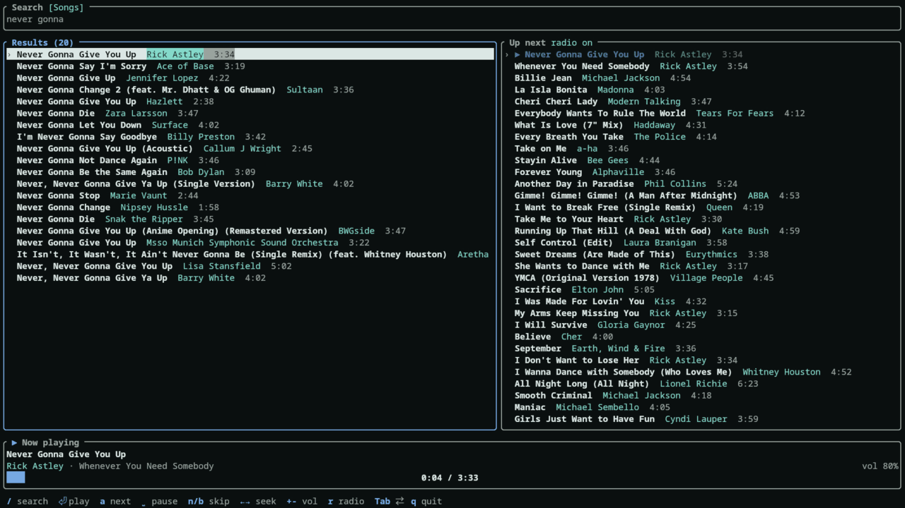

# Simple YTM TUI

YouTube Music in the terminal with endless radio autoplay. No Google account needed.

<p align="center">
  
</p>

Search uses the same logged-out API the music.youtube.com web app uses. Playback goes
through headless `mpv`, with `yt-dlp` resolving the audio. mpv's playlist is the queue,
so desktop media controls (via `mpv-mpris`) can pause and skip.

## Requirements

```
sudo pacman -S mpv yt-dlp mpv-mpris
```

## Install

```
cargo install --path . --root ~/.local
```

## Keys

| Key | Action |
|---|---|
| `/` | search (Tab toggles Songs / Videos, Enter runs it, Esc cancels) |
| `Enter` | play the selected result and start a radio from it (or jump to a queued track) |
| `a` | play the selected result next |
| `Tab` | switch between Results and Up next |
| `j`/`k`, arrows | move |
| `space` | pause |
| `n` / `b` | next / previous (restarts the track if you are more than 5 s in) |
| `←` / `→` | seek 10 s |
| `+` / `-` | volume |
| `r` | radio autoplay on/off |
| `f` | re-run the last search as Songs / Videos |
| `d` | remove from Up next |
| `q` | quit |

## If playback breaks

YouTube changes things often. Update yt-dlp first: `sudo pacman -Syu yt-dlp`.
`ytm --selftest "some song"` checks search and radio without the UI.

## License

Copyright (C) 2026 Oneeb Zahid. Licensed under the GNU GPL v3 or later; see [LICENSE](LICENSE).
